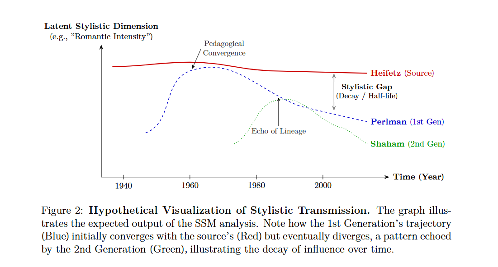
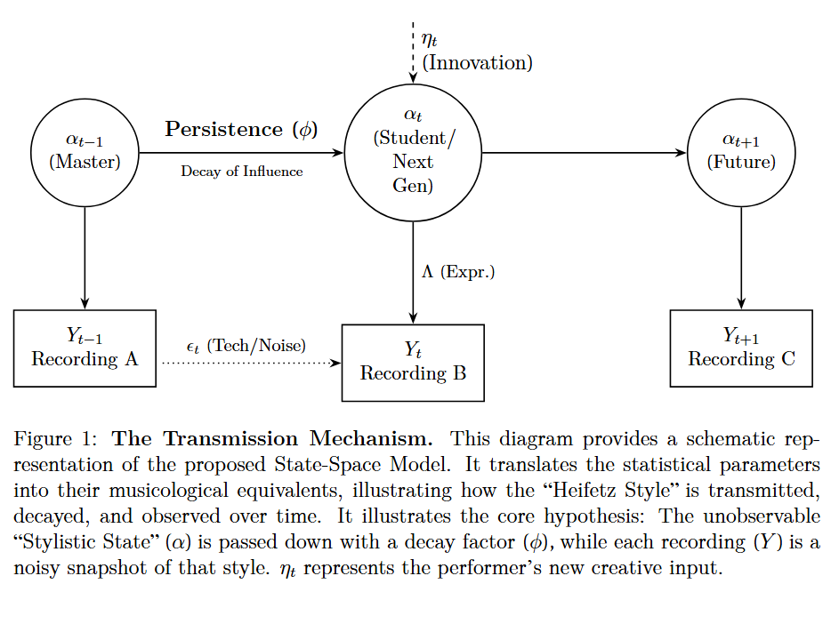

# Project: Heifetz's Shadow (Pilot Study)
**A Structural Econometric Approach to the Dynamic Transmission of Violin Performance Styles**

> **💡 Project Context:**
> *This repository contains the **research prototype** developed for my MSc dissertation at the Royal College of Music (RCM). It serves as a supplementary code portfolio to demonstrate the implementation of **Music Information Retrieval (MIR)** and **Econometric Modeling** pipelines used to validate the research hypothesis.*

## 1. Overview
This project aims to quantify the "Thesis-Antithesis" evolution in 20th-century violin performance (e.g., Heifetz vs. Szeryng) by bridging audio signal processing with time-series econometrics. The Python prototype hosted here was developed to test the feasibility of this interdisciplinary framework.

*Figure 1: Hypothetical Visualization of Stylistic Transmission. The model aims to quantify the 'Stylistic Gap' and convergence rate (ϕ) between the master (Red) and the student (Blue).*

## 2. Methodology (Pilot Implementation)
To validate the model structure, a pilot test was conducted with a purposive sample of 4 seminal recordings (N=4) of Bach's *Chaconne*.

* **Feature Extraction:** Used `librosa` to extract the 'Golden Trio' features:
    * `V_Pitch`: Vibrato intensity (F0 Standard Deviation via pYIN)
    * `V_Timbre`: Tonal brightness (Spectral Centroid)
    * `V_Rhythm`: Rhythmic flexibility (Inter-Beat Interval SD)
* **Statistical Modeling:** Implemented a **Dynamic Factor Model (DFM)** within a State-Space Framework using `statsmodels` (leveraging the Kalman Filter for likelihood estimation).
    * **Auto-Selection Logic:** The algorithm compares Model A ($k=1$) and Model B ($k=2$) via AIC to objectively determine the optimal structure.
 
  
*Figure 2: The Transmission Mechanism. This schematic corresponds to the `statsmodels.tsa.DynamicFactor` implementation in the code, where α_t represents the unobservable stylistic state derived from the observed audio features (Y_t).*

## 3. Preliminary Results (N=4)
The prototype successfully processed the audio data, and the algorithm **autonomously selected the 2-Factor Model** as the optimal structure.
* **Model Selection:** Model B ($k=2$, AIC=28.30) significantly outperformed Model A ($k=1$, AIC=36.51), empirically supporting the proposed dialectical evolution.
* **Semantic Validation:** Factor Loadings confirmed that Factor 2 acts as a "Control Factor" (suppressing vibrato/rubato), aligning with the historical "Objectivist" style.

## 4. Tools Used
The following libraries were utilized to implement the research pipeline:
* **Language:** Python 3.10
* **Audio Processing:** Librosa (Feature extraction & Signal processing)
* **Econometrics:** Statsmodels (Kalman Filter & Dynamic Factor Models)
* **Data Management:** Pandas & NumPy

## 5. Current Limitations
Due to the small sample size (N=4) in this pilot phase, the Hessian matrix may be near-singular. The full-scale research will utilize the RCM archive (N>100) to ensure statistical robustness and parameter stability.

---
*Author: Minsuk Lee (MSc Candidate, Royal College of Music; BA, University of Cambridge)*
